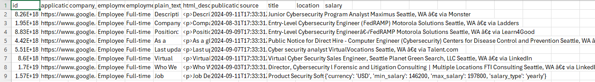
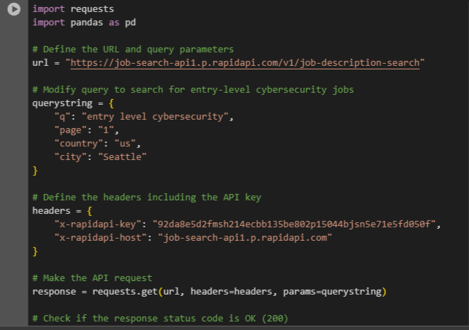

# Entry-Level Cybersecurity Jobs Scraper
## Table of Contents
- [Project Description](#project-description)
- [Installation](#installation)
- [Usage](#usage)
- [Customization](#customization)
- [License](#license)
- [Contributing](#contributing)
- [Credits](#credits)

# Project Description
This project is designed to scrape entry-level cybersecurity job listings from an external job search API and save the data into a CSV file. The script sends a request to the API, retrieves job data specific to entry-level cybersecurity positions in Seattle, and processes the data into a structured format using pandas. This tool is useful for data analysts, job seekers, and researchers looking for insights into the entry-level job market in the cybersecurity field.



# Installation
To run this project, you'll need Python installed on your system along with the required libraries. Follow the steps below to get started:

# Clone the repository (if applicable):

<!-- python code block -->
```python
git clone https://github.com/yourusername/entry-level-cybersecurity-jobs-scraper.git
cd entry-level-cybersecurity-jobs-scraper
```

Install the required Python packages: Make sure you have Python installed. You can install the required packages using pip:

<!-- python code block -->
```python
pip install requests pandas
```
Set up your API Key: Replace the placeholder API key in the script (x-rapidapi-key) with your actual key from RapidAPI.

# Usage
To run the script and retrieve the job data, execute the following command:

<!-- python code block -->
```python
python job_scraper.py
```
The script will fetch entry-level cybersecurity job listings for Seattle, process the data, and save it to a CSV file named entry_level_cybersecurity_jobs.csv in the current directory.



# Customization
You can customize the query parameters in the script to change the job search criteria:

q: The search query. Currently set to "entry level cybersecurity".
page: The page number of the search results.
country: The country filter, currently set to the US.
```bash
#!/bin/bash
# Change to search for jobs in New York City
city: 'New York'
```

city: The city filter, currently set to Seattle.
Modify these parameters as needed to suit your requirements.

# License
This project is licensed under the MIT License. See the LICENSE file for details.

# Contributing
Contributions are welcome! Please open an issue or submit a pull request if you have suggestions or improvements.

# Fork the repository.
Create your feature branch (git checkout -b feature/AmazingFeature).
Commit your changes (git commit -m 'Add some AmazingFeature').
Push to the branch (git push origin feature/AmazingFeature).
Open a pull request.
# Credits
Developer: Your Name (youremail@example.com)
This project uses data from the Job Search API available on RapidAPI.
